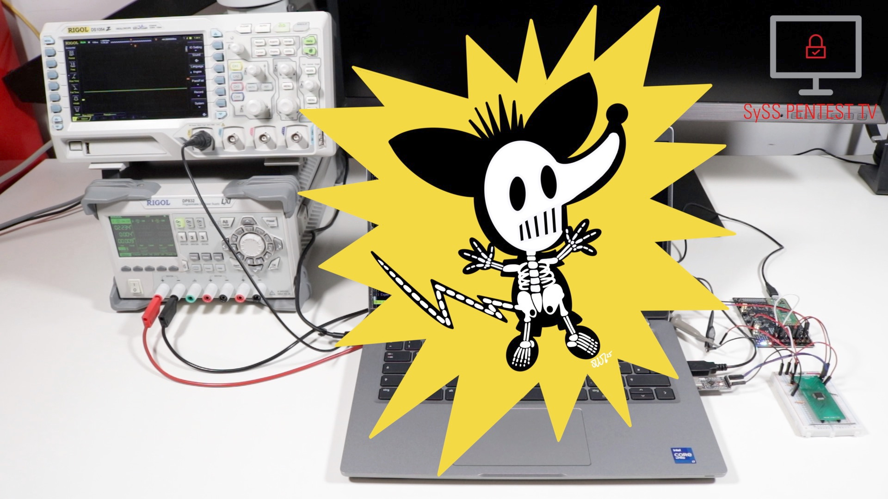

# LPC1343 PicoGlitcher

Python script for voltage glitching attacks against the code read protection (CRP) of an [LPC1343](https://www.nxp.com/products/LPC1343FBD48) microcontroller using the [Pico Glitcher](https://mkesenheimer.github.io/blog/pico-glitcher-v2.html) and the fault-injection software library [findus](https://fault-injection-library.readthedocs.io/) by Dr. Matthias Kesenheimer.

## Demo Video

A video demonstrating a voltage glitching attack using the [Pico Glitcher](https://mkesenheimer.github.io/blog/pico-glitcher-v2.html) and [findus](https://fault-injection-library.readthedocs.io/) is available on YouTube: [Voltage Glitching with the Pico Glitcher and Findus](https://www.youtube.com/watch?v=3To4tyzmRsg):

## Disclaimer

Use at your own risk. Do not use without full consent of everyone involved.
For educational purposes only.
